# SlcanX 的 Linux SocketCAN 使用

- [SlcanX 的 Linux SocketCAN 使用](#slcanx-的-linux-socketcan-使用)
  - [SocketCAN 的启用](#socketcan-的启用)
  - [位时间设置与CANoe测试](#位时间设置与canoe测试)
  - [12W帧/s 的发送测试](#12w帧s-的发送测试)
  - [12W帧/s 的接收测试](#12w帧s-的接收测试)
  - [基本发送 cansend](#基本发送-cansend)
  - [接收与过滤 candump](#接收与过滤-candump)
  - [录包与回放 candump canplayer](#录包与回放-candump-canplayer)
  - [日志转换 log asc blf](#日志转换-log-asc-blf)
  - [嗅探 cansniffer](#嗅探-cansniffer)
  - [负载率 canbusload](#负载率-canbusload)
  - [网关 cangw](#网关-cangw)
  - [C SocketCAN](#c-socketcan)
  - [C SocketCAN epoll](#c-socketcan-epoll)
  - [C++ SocketCAN Asio](#c-socketcan-asio)
  - [Python3 SocketCAN Asyncio](#python3-socketcan-asyncio)
  - [Rust SocketCAN](#rust-socketcan)
  - [ISOTP](#isotp)
  - [WSL](#wsl)
  - [结语](#结语)


## SocketCAN 的启用

用到两个部分:

- **slcandx**: 用户空间程序, 设置 速率 采样点 位时间 开关通道等, 正常会后台运行.
- **slcanx_module**: 是对接到 SocketCAN 的 Kernel Module

欢迎 Star, 源码开放在 [https://github.com/weifengdq/SlcanX](https://github.com/weifengdq/SlcanX)

已测试的环境:

- `u20_k515_slcanx/`: 
  - PC, Ubuntu 20.04 with Kernel 5.15.x  (can0 can1 can2 can3)
  - **NVIDIA Jetson Orin**, Ubuntu 22.04 with Kernel 5.15.x (can2 can3 can4 can5)
- `u22_k68_slcanx/`: PC, Ubuntu 22.04 with Kernel 6.8.x
- `u24_k614_slcanx/`: PC, Ubuntu 24.04 with Kernel 6.14.x

文件列表:

```bash
├── slcandx
│   ├── Makefile
│   └── slcandx.c
└── slcanx_module
    ├── Makefile
    ├── slcan-core.c
    ├── slcan-ethtool.c
    └── slcan.h
```

均使用 Makefile:

```bash
# 清理
make clean

# 编译
make

# 安装
# slcandx 默认被装到 /usr/local/bin
make install
```

通过速率+采样点设置4个通道为`1M 80% + 5M 75%`的参考脚本 `B_1M_5M.sh`:

```bash
#!/bin/bash

tty_device="/dev/ttyACM0"
can_ifs=(0 1 2 3)
nominal_bitrate=(1000000 1000000 1000000 1000000)
nominal_sample_point=(800 800 800 800)
data_bitrate=(5 5 5 5)
data_sample_point=(750 750 750 750)
txqueuelength=10000

for i in "${can_ifs[@]}"; do
	if ip link show can$i &> /dev/null; then
		echo "Bringing down and deleting interface can$i"
		sudo ip link set down can$i
		sudo ip link delete can$i
	fi
done

if pgrep slcandx &> /dev/null; then
	echo "Killing slcandx processes"
	sudo pkill slcandx
  sleep 1
  sudo ./slcandx/slcandx -t hw -0c -1c -2c -3c $tty_device
  sudo pkill slcandx
  sleep 1
fi

if lsmod | grep -q slcanx; then
	echo "Removing slcanx module"
	sudo rmmod slcanx
fi

sudo modprobe can
sudo modprobe can-raw
sudo modprobe can-dev
sudo insmod ./slcanx_module/slcanx.ko tx_batch_us=125

sudo ./slcandx/slcandx -t hw \
	-0c -0y${nominal_bitrate[0]} -0Y${data_bitrate[0]} -0p${nominal_sample_point[0]} -0P${data_sample_point[0]} -0o \
  -1c -1y${nominal_bitrate[1]} -1Y${data_bitrate[1]} -1p${nominal_sample_point[1]} -1P${data_sample_point[1]} -1o \
  -2c -2y${nominal_bitrate[2]} -2Y${data_bitrate[2]} -2p${nominal_sample_point[2]} -2P${data_sample_point[2]} -2o \
  -3c -3y${nominal_bitrate[3]} -3Y${data_bitrate[3]} -3p${nominal_sample_point[3]} -3P${data_sample_point[3]} -3o \
  $tty_device

for i in "${can_ifs[@]}"; do
  sudo ip link set up can$i
  sudo ip link set txqueuelen $txqueuelength can$i
done
```

通过 `时钟_预分频_SEG1_SEG2_TDC` 设置`1M 80% + 5M 75%` 的参考脚本 `A_1M_5M.sh`:

```bash
#!/bin/bash

tty_device="/dev/ttyACM0"
can_ifs=(0 1 2 3)
txqueuelength=10000
# CLK_PRE_SEG1_SEG2_SJW_TDC
nominal=(80_4_15_4_4_0 80_4_15_4_4_0 80_4_15_4_4_0 80_4_15_4_4_0)
data=(80_1_11_4_4_1 80_1_11_4_4_1 80_1_11_4_4_1 80_1_11_4_4_1)

for i in "${can_ifs[@]}"; do
	if ip link show can$i &> /dev/null; then
		echo "Bringing down and deleting interface can$i"
		sudo ip link set down can$i
		sudo ip link delete can$i
	fi
done

if pgrep slcandx &> /dev/null; then
	echo "Killing slcandx processes"
	sudo pkill slcandx
  sleep 1
  sudo ./slcandx/slcandx -t hw -0c -1c -2c -3c $tty_device
  sudo pkill slcandx
  sleep 1
fi

if lsmod | grep -q slcanx; then
	echo "Removing slcanx module"
	sudo rmmod slcanx
fi

sudo modprobe can
sudo modprobe can-raw
sudo modprobe can-dev
sudo insmod ./slcanx_module/slcanx.ko tx_batch_us=125

sudo ./slcandx/slcandx -t hw \
	-0c -0a${nominal[0]} -0A${data[0]} -0o \
  -1c -1a${nominal[0]} -1A${data[0]} -1o \
  -2c -2a${nominal[0]} -2A${data[0]} -2o \
  -3c -3a${nominal[0]} -3A${data[0]} -3o \
  $tty_device

for i in "${can_ifs[@]}"; do
  sudo ip link set up can$i
  sudo ip link set txqueuelen $txqueuelength can$i
done
```

无论何时, 推荐类似 `A_1M_5M.sh` 这种精确的设置方式.

SocketCAN 的最大意义个人认为是五花八门的功能都可以用单个的进程实现, 避免了大型和复杂工程的心力交瘁, 屎山堆积, 有海量的例子可以进行仿写. 同一通道 时间同步 通信 标定 诊断 录包回放 统计 DBC解析 等各司其职, 不同应用, 轻量便捷.

下面走马观花的看一下 SocketCAN 的 测试 例子等.

## 位时间设置与CANoe测试

下表中打 ✔ 的是 SlcanX 与 CANoe 对接测试过:

| BitRate(Mbit/s)_SamplePoint(‰) | SlcanX(CLK_PRE_SEG1_SEG2_SJW_TDC) | CANoe测试 |
| ------------------------------ | --------------------------------- | --------- |
| 0.125_800                      | 80_8_63_16_16_0                   | ✔         |
| 0.25_800                       | 80_4_63_16_16_0                   | ✔         |
| 0.5_800                        | 80_2_63_16_16_0                   | ✔         |
| 1_800                          | 80_2_31_8_8_0                     | ✔         |
| 2_800                          | 80_2_15_4_4_1                     | ✔         |
| 3_800                          | 60_1_15_4_4_1                     |           |
| 4_800                          | 80_1_15_4_4_1                     | ✔         |
| 5_750                          | 80_1_11_4_4_1                     | ✔         |
| 6_800                          | 60_1_7_2_2_1                      |           |
| 8_800                          | 80_1_7_2_2_1                      | ✔         |
| 9_750                          | 72_1_5_2_2_1                      |           |
| 10_750                         | 80_1_5_2_2_1                      |           |
| 12_800                         | 80_1_3_1_1_1                      |           |

以 `1M 80% + 8M 80%` 为例, SlcanX 和 CANoe 设置截图:

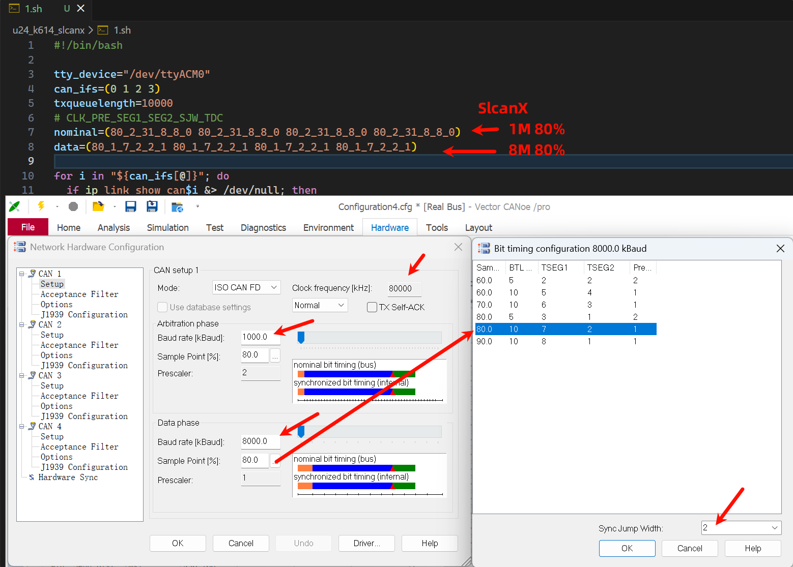

收发测试:

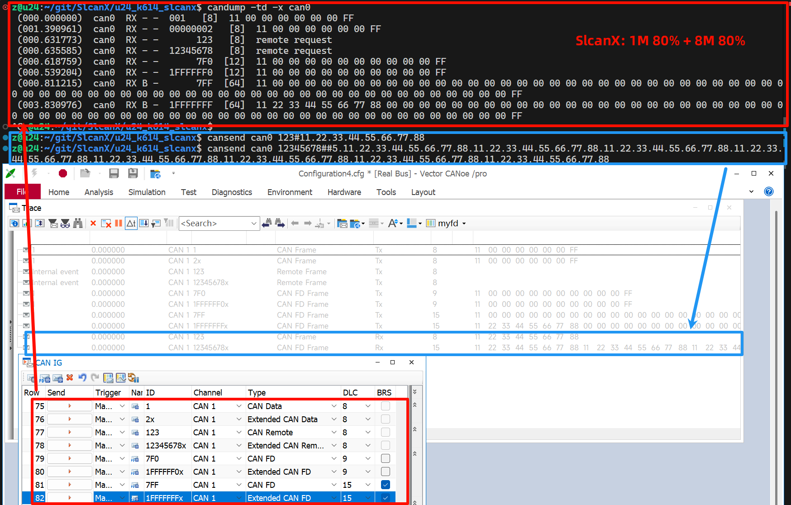

## 12W帧/s 的发送测试

SlcanX 的 4 个通道与 Vector VN1640A 的 4 个通道一一相连, 速率 `1M 80% + 8M 80%`.

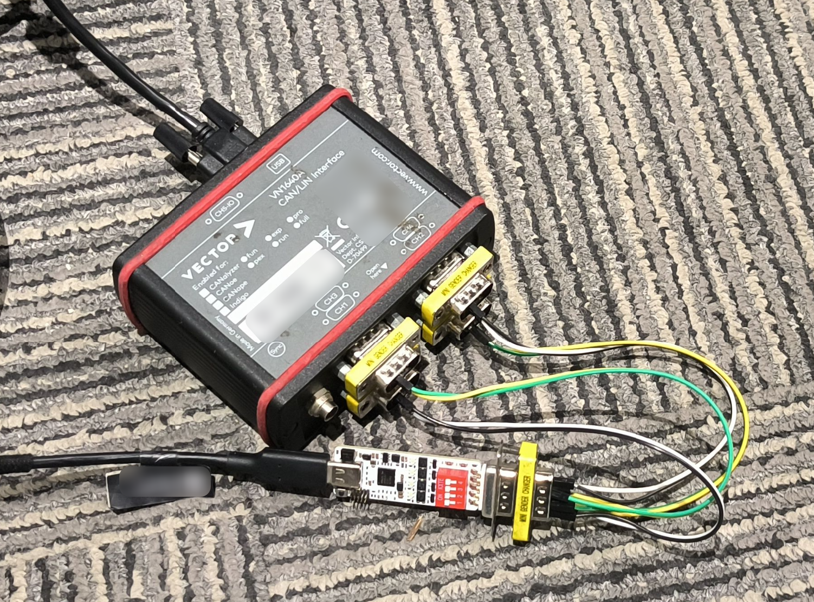

SlcanX 发, CANoe 收, 注意终端电阻, 使用 cangen 命令, 进行发送测试:

```bash
cangen can0 -g 0.001 -I 555 -L 0 -b
cangen can0 -g 0.001 -I 555 -L 0 -b

cangen can1 -g 0.001 -I 555 -L 0 -b
cangen can1 -g 0.001 -I 555 -L 0 -b

cangen can2 -g 0.001 -I 555 -L 0 -b
cangen can2 -g 0.001 -I 555 -L 0 -b

cangen can3 -g 0.001 -I 555 -L 0 -b
cangen can3 -g 0.001 -I 555 -L 0 -b
```

如图, 每通道都达到了 3W帧/s, 99.7% 的负载率, 四路合计超 12W帧/s

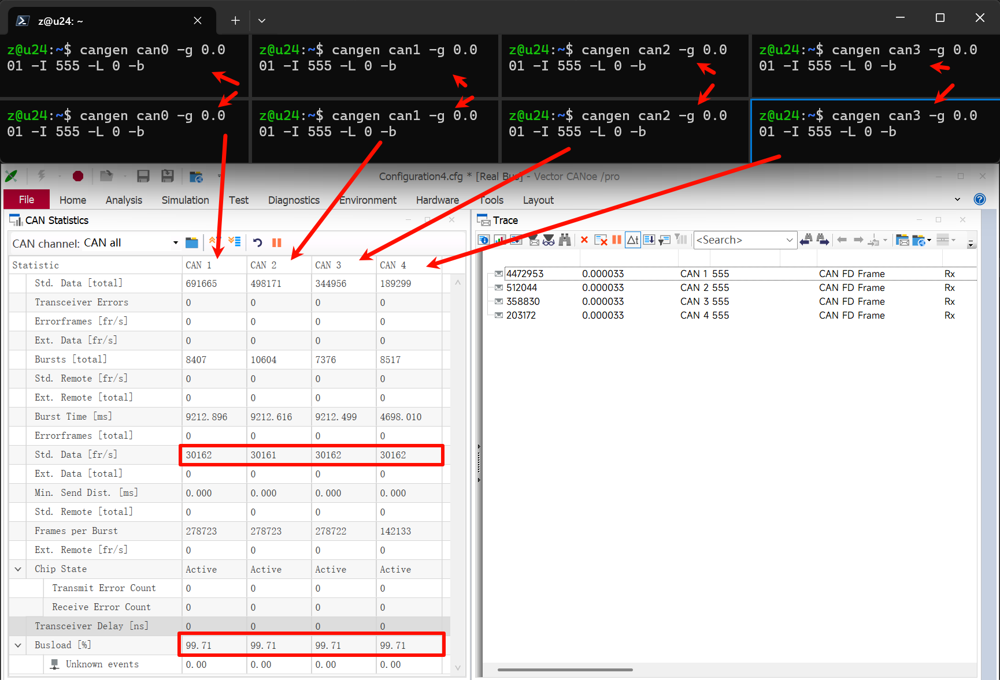

## 12W帧/s 的接收测试

SlcanX 的 4 个通道与 Vector VN1640A 的 CAN1 相连, 速率 `1M 80% + 8M 80%`. 注意总线终端电阻.

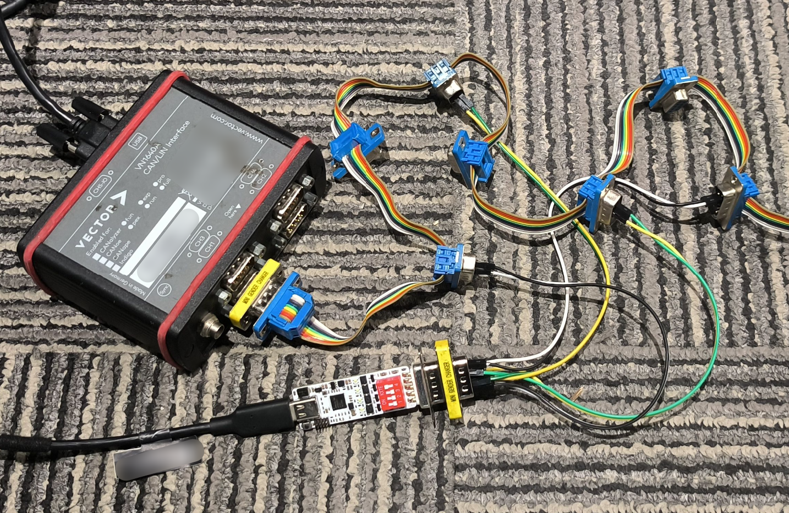

SlcanX 收:

```bash
candump -l -r 10485760 can0
candump -l -r 10485760 can1
candump -l -r 10485760 can2
candump -l -r 10485760 can3
```

CANoe 发, 在 CAN1 上发送 30组 1ms 周期的帧, 负载率 100%, 对应 SlcanX 的接收是 12W帧/s:

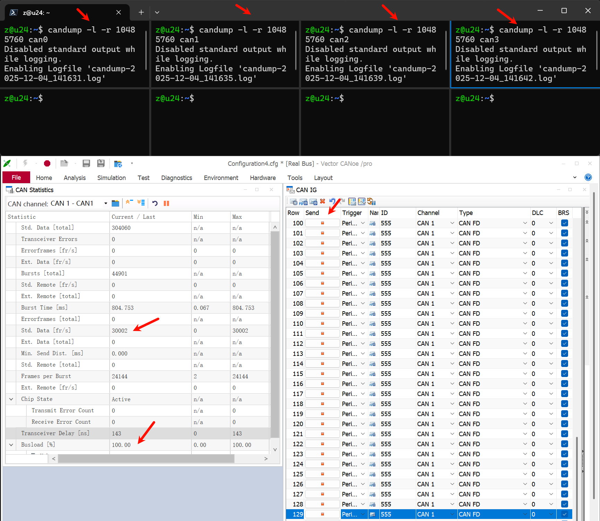

停掉CANoe的发送, 也C掉 candump 的录包, 查看 SlcanX 四路CAN实际的接收行数, 与 CANoe 的发送对应 1429666:

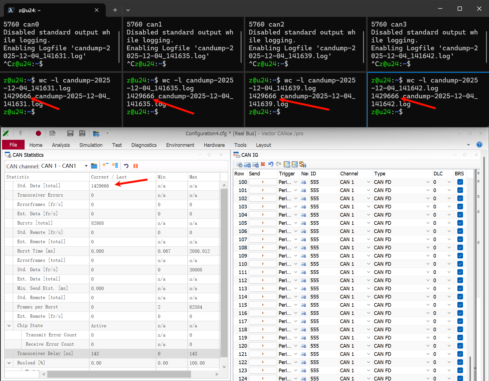

## 基本发送 cansend

```bash
# 发送 CAN20 标准帧, ID 0x123, 长度8, 数据 0x11 0x22 0x33 0x44 0x55 0x66 0x77 0x88
# 注意标准帧ID始终是3字节, 不够前补0, ID 0x1 应写作 001
cansend can0 123#11.22.33.44.55.66.77.88

# 发送 CAN20 扩展帧
# 注意标准帧ID始终是8字节, 不够前补0, ID 0xCBF0 应写作 0000CBF0
cansend can0 01234567#11.22.33.44.55.66.77.88

# 发送 CAN20 远程帧
# R后跟len
cansend can0 123#R8
cansend can0 12345678#R7

# 发送 CANFD
# 发9字节, 超过8, 小于12, 不够12的会自动补0
# 实际发送的是 11.22.33.44.55.66.77.88.99.00.00.00
cansend can0 123##4.11.22.33.44.55.66.77.88.99

# 发送 CANFD with BRS
cansend can0 123##5.11.22.33.44.55.66.77.88.99
```


## 接收与过滤 candump

```bash
candump can0

# 加时间戳 方向 标志位
candump -ta -x can0

# 增量时间 方向 标志位
candump -td -x can0

# 过滤出 0x123 和 0x1234567A
candump -ta -x can0,123:7FF,1234567A:1FFFFFFF

# 用 any 查看所有通道 (can0 can1 can2 ...) 的数据
candump -ta -x any
```


## 录包与回放 candump canplayer

```bash
# 接收到的can报文存为log, 名字默认类似 candump-2025-12-04_115641.log
candump -l can0

# log 数据参考
(1764820617.605366) can0 001#11000000000000FF
(1764820618.119432) can0 00000002#11000000000000FF
(1764820618.650797) can0 123#R8
(1764820619.407594) can0 12345678#R8
(1764820619.840368) can0 7F0##41100000000000000000000FF
(1764820620.423334) can0 1FFFFFF0##41100000000000000000000FF
(1764820620.818442) can0 7FF##5110000000000000000000000000000000000000000000000000000000000000000000000000000000000000000000000000000000000000000000000000000FF
(1764820621.835274) can0 1FFFFFFF##5112233445566778800000000000000000000000000000000000000000000000000000000000000000000000000000000000000000000000000000000000000FF

# 录指定ID的包, 0x123, 0x1FFFFFF0
candump -l can0,123:7FF,1FFFFFF0:1FFFFFFF

# 录所有通道
candump -l any

# 回放报文
canplayer -v -I 2.log
# 循环回放
canplayer -v -l i -I 2.log
# can1的报文在can0回放
canplayer -v -I eyeq3.log can0=can1
# can1的报文在can0循环回放, 不打印
canplayer -l i -I eyeq3.log can0=can1
```


## 日志转换 log asc blf

can-utils 中 log 与 asc 的互转:

```bash
log2asc -I candump-2025-12-04_115641.log -O 1.asc can0
asc2log -I 1.asc -O 2.log
```

python-can 中 blf asc 的转换 blf2asc.py, 使用 BLFReader 和 ASCWriter:

```bash
#!/usr/bin/python3

# https://stackoverflow.com/questions/70757009/how-do-i-convert-blf-data-of-can-to-asc-using-python

import can
import sys

# blf_file use $1
blf_file = sys.argv[1]
asc_file = blf_file.replace('.blf', '.asc')

with open(blf_file, 'rb') as f_in:
    log_in = can.io.BLFReader(f_in)

    with open(asc_file, 'w') as f_out:
        log_out = can.io.ASCWriter(f_out)
        for msg in log_in:
            log_out.on_message_received(msg)
        log_out.stop()
```

参考 [File IO - python-can 4.6.1 documentation](https://python-can.readthedocs.io/en/stable/file_io.html):

- The format is determined from the file suffix which can be one of:

  - .asc [`can.ASCReader`](https://python-can.readthedocs.io/en/stable/file_io.html#can.ASCReader)

  - .blf [`can.BLFReader`](https://python-can.readthedocs.io/en/stable/file_io.html#can.BLFReader)
  - .csv [`can.CSVReader`](https://python-can.readthedocs.io/en/stable/file_io.html#can.CSVReader)
  - .db [`can.SqliteReader`](https://python-can.readthedocs.io/en/stable/file_io.html#can.SqliteReader)
  - .log [`can.CanutilsLogReader`](https://python-can.readthedocs.io/en/stable/file_io.html#can.CanutilsLogReader)
  - .mf4 [`can.MF4Reader`](https://python-can.readthedocs.io/en/stable/file_io.html#can.MF4Reader) (optional, depends on [asammdf](https://github.com/danielhrisca/asammdf))
  - .trc [`can.TRCReader`](https://python-can.readthedocs.io/en/stable/file_io.html#can.TRCReader)

- The format is determined from the file suffix which can be one of:

  - .asc [`can.ASCWriter`](https://python-can.readthedocs.io/en/stable/file_io.html#can.ASCWriter)
  - .blf [`can.BLFWriter`](https://python-can.readthedocs.io/en/stable/file_io.html#can.BLFWriter)
  - .csv: [`can.CSVWriter`](https://python-can.readthedocs.io/en/stable/file_io.html#can.CSVWriter)
  - .db [`can.SqliteWriter`](https://python-can.readthedocs.io/en/stable/file_io.html#can.SqliteWriter)
  - .log [`can.CanutilsLogWriter`](https://python-can.readthedocs.io/en/stable/file_io.html#can.CanutilsLogWriter)
  - .mf4 [`can.MF4Writer`](https://python-can.readthedocs.io/en/stable/file_io.html#can.MF4Writer) (optional, depends on [asammdf](https://github.com/danielhrisca/asammdf))
  - .trc [`can.TRCWriter`](https://python-can.readthedocs.io/en/stable/file_io.html#can.TRCWriter).txt [`can.Printer`](https://python-can.readthedocs.io/en/stable/file_io.html#can.Printer)

当然, Python 的效率可能比较低, 可以参考代码转成 C++ 或 Rust 原地提升效率, 也可以考虑利用多核CPU多线程转换等.

## 嗅探 cansniffer

```bash
cansniffer can0 -c -t 0
```

对于变化的字节高亮显示:

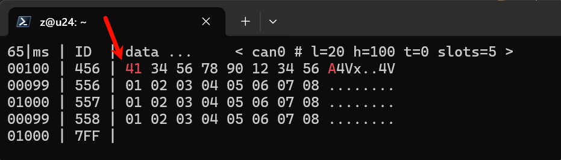

## 负载率 canbusload

查看4个通道1M+8M时的负载率:

```bash
canbusload can0@1000000,8000000 can1@1000000,8000000 can2@1000000,8000000 can3@1000000,8000000 -r -t -b -c
```

如图:

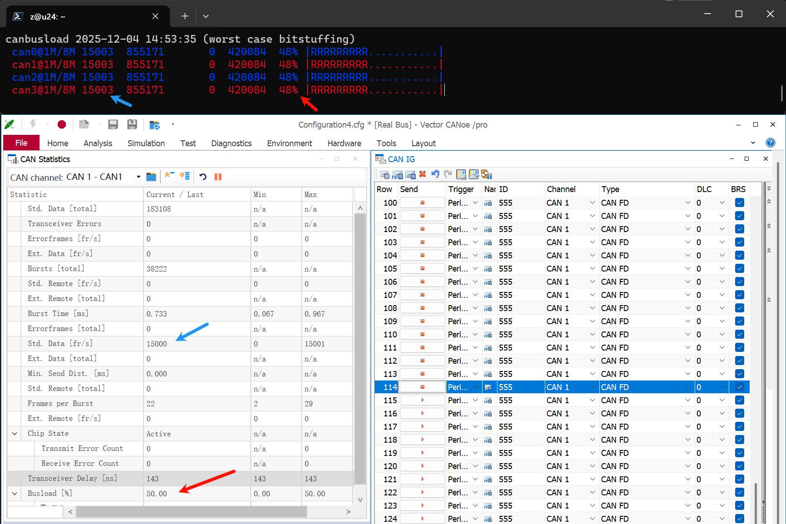

其它用法使用 `canbusload -h` 查看帮助

## 网关 cangw

使用 `cangw -h` 查看帮助, 怎么添加删除列出已有规则等, 注意使用前需要先:

```bash
sudo modprobe can-gw
```

添加规则需要加 sudo.

如把 can0 can1 can2 的 canfd 帧全聚合转发到 can3, 且转发的帧全变为 canfd with brs

```bash
#!/bin/bash

# Flush all existing rules
sudo cangw -F

# 64 bytes of zero data (128 hex characters)
DATA="00000000000000000000000000000000000000000000000000000000000000000000000000000000000000000000000000000000000000000000000000000000"

# Forward can0, can1, can2 to can3
# -X: CAN FD rule
# -M: Modify CAN FD frame
# SET:F: Set Flags
# 0.01.0.$DATA -> ID=0, Flags=0x01 (BRS), Len=0, Data=...
# Only Flags are modified because of SET:F
for dev in can0 can1 can2; do
    sudo cangw -A -s $dev -d can3 -e -X -M SET:F:0.01.0.$DATA
done
```

如果想把 can0 can1 can2 的 can2.0 或 canfd 的帧全聚合转发到 can3, 且转发的帧全变为 canfd with brs:

- **CAN FD 帧**：继续使用 `cangw` 内核网关进行转发,  `cangw` 工具本身暂不支持直接将 Classical CAN 帧转换为 CAN FD 帧 ?
- **Classical CAN 帧**：使用用户空间桥接（`candump` -> `cansend`）来实现。

```bash
#!/bin/bash

# Flush all existing rules
sudo cangw -F

# 64 bytes of zero data (128 hex characters)
DATA="00000000000000000000000000000000000000000000000000000000000000000000000000000000000000000000000000000000000000000000000000000000"

# 1. Forward CAN FD frames from can0, can1, can2 to can3
# -X: CAN FD rule
# -M: Modify CAN FD frame
# SET:F: Set Flags
# 0.01.0.$DATA -> ID=0, Flags=0x01 (BRS), Len=0, Data=...
for dev in can0 can1 can2; do
    sudo cangw -A -s $dev -d can3 -e -X -M SET:F:0.01.0.$DATA
done

# 2. Forward Classical CAN frames and convert to CAN FD with BRS
# Since cangw cannot convert Classical CAN to CAN FD, we use a user-space bridge.
# We filter out CAN FD frames (containing '##') to avoid duplication.

# Stop previous background jobs if any
pkill -f "candump -L can0 can1 can2" 2>/dev/null

# Start the bridge in background
# candump -L outputs: (timestamp) interface ID#Data
# We convert ID#Data to ID##1Data (CAN FD with BRS)
nohup bash -c 'stdbuf -oL candump -L can0 can1 can2 | grep --line-buffered -v "##" | while read line; do
    frame=$(echo "$line" | awk "{print \$3}")
    # Replace first # with ##1
    new_frame=${frame/\#/##1}
    cansend can3 "$new_frame"
done' >/dev/null 2>&1 &

echo "Rules applied. User-space bridge started for Classical CAN -> CAN FD conversion."
```

如图(忽略 can3 有些会显示 RX 但实际 TX 的现象):

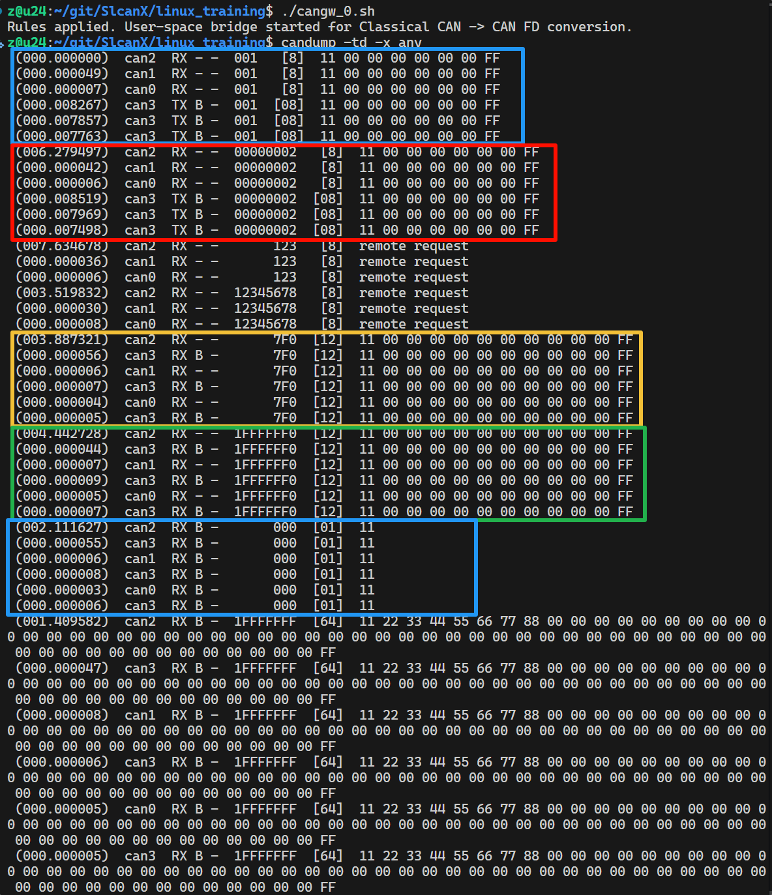

事实上这种需求还是用 C 或 C++ 简单搓一个比较容易些.

## C SocketCAN

用 C 实现 `Forwarding can0, can1, can2 -> can3 (CAN FD BRS)`

```c
#include <stdio.h>
#include <stdlib.h>
#include <string.h>
#include <unistd.h>
#include <net/if.h>
#include <sys/ioctl.h>
#include <sys/socket.h>
#include <linux/can.h>
#include <linux/can/raw.h>

int main(void)
{
    int s;
    struct sockaddr_can addr;
    struct ifreq ifr;
    int ifidx_can0, ifidx_can1, ifidx_can2, ifidx_can3;
    int enable_canfd = 1;
    int loopback = 0;

    // Cleanup existing rules and background jobs from previous scripts
    // This prevents double forwarding if cangw_0.sh was run previously
    system("sudo cangw -F > /dev/null 2>&1");
    system("pkill -f \"candump -L can0 can1 can2\" > /dev/null 2>&1");

    // Create socket
    if ((s = socket(PF_CAN, SOCK_RAW, CAN_RAW)) < 0) {
        perror("Socket");
        return 1;
    }

    // Enable CAN FD support
    if (setsockopt(s, SOL_CAN_RAW, CAN_RAW_FD_FRAMES, &enable_canfd, sizeof(enable_canfd))){
        perror("setsockopt CAN_RAW_FD_FRAMES");
        return 1;
    }

    // Disable loopback (prevent receiving frames sent by this socket)
    if (setsockopt(s, SOL_CAN_RAW, CAN_RAW_LOOPBACK, &loopback, sizeof(loopback))){
        perror("setsockopt CAN_RAW_LOOPBACK");
        return 1;
    }

    // Get interface indices
    ifidx_can0 = if_nametoindex("can0");
    ifidx_can1 = if_nametoindex("can1");
    ifidx_can2 = if_nametoindex("can2");
    ifidx_can3 = if_nametoindex("can3");

    if (ifidx_can0 == 0 || ifidx_can1 == 0 || ifidx_can2 == 0 || ifidx_can3 == 0) {
        fprintf(stderr, "One of the interfaces can0-can3 not found\n");
        return 1;
    }

    // Bind to all interfaces
    memset(&addr, 0, sizeof(addr));
    addr.can_family = AF_CAN;
    addr.can_ifindex = 0; // Any interface

    if (bind(s, (struct sockaddr *)&addr, sizeof(addr)) < 0) {
        perror("Bind");
        return 1;
    }

    printf("cangw_c: Forwarding can0, can1, can2 -> can3 (CAN FD BRS)\n");

    // Loop
    while (1) {
        struct canfd_frame frame;
        struct sockaddr_can src_addr;
        socklen_t len = sizeof(src_addr);
        
        // Read frame
        int nbytes = recvfrom(s, &frame, sizeof(frame), 0, (struct sockaddr *)&src_addr, &len);
        
        if (nbytes < 0) {
            perror("read");
            return 1;
        }

        // Check source interface
        int src_idx = src_addr.can_ifindex;
        if (src_idx != ifidx_can0 && src_idx != ifidx_can1 && src_idx != ifidx_can2) {
            continue;
        }

        // Prepare frame for sending to can3
        struct canfd_frame out_frame;
        memset(&out_frame, 0, sizeof(out_frame));

        if (nbytes == sizeof(struct can_frame)) {
            // Received Classical CAN frame
            struct can_frame *cf = (struct can_frame *)&frame;
            
            out_frame.can_id = cf->can_id;
            out_frame.len = cf->can_dlc; 
            
            // Copy data
            memcpy(out_frame.data, cf->data, cf->can_dlc);
            
            // Clear RTR flag as CAN FD does not support it
            if (out_frame.can_id & CAN_RTR_FLAG) {
                out_frame.can_id &= ~CAN_RTR_FLAG;
            }
            
        } else if (nbytes == sizeof(struct canfd_frame)) {
            // Received CAN FD frame
            out_frame = frame;
        } else {
            // Unknown size, ignore
            continue;
        }

        // Force CAN FD BRS
        out_frame.flags |= CANFD_BRS;
        
        // Send to can3
        struct sockaddr_can dst_addr;
        memset(&dst_addr, 0, sizeof(dst_addr));
        dst_addr.can_family = AF_CAN;
        dst_addr.can_ifindex = ifidx_can3;
        
        // Send as CAN FD frame (sizeof(struct canfd_frame))
        int wbytes = sendto(s, &out_frame, sizeof(out_frame), 0, (struct sockaddr *)&dst_addr, sizeof(dst_addr));
        
        if (wbytes < 0) {
            perror("write");
        }
    }

    close(s);
    return 0;
}

```

编译 `gcc -o cangw cangw_c.c`

注意关闭了 loopback, 在 candump 应该看不出 can3 的 TX 了, 实际是发出来的.

## C SocketCAN epoll

一般收发会开线程, 但更多更多的CAN不能开越来越多的线程, 需要用到多路复用, 如 epoll, 在 can-utils 中 `candump any` 也是类似的实现, 可以借鉴.

用 epoll 实现 `Forwarding can0, can1, can2 -> can3 (CAN FD BRS)`的例子:

```c
#include <stdio.h>
#include <stdlib.h>
#include <string.h>
#include <unistd.h>
#include <net/if.h>
#include <sys/ioctl.h>
#include <sys/socket.h>
#include <sys/epoll.h>
#include <linux/can.h>
#include <linux/can/raw.h>
#include <errno.h>

#define MAX_EVENTS 10

// Helper to open and configure a CAN socket
int open_can_socket(const char *ifname) {
    int s;
    struct sockaddr_can addr;
    struct ifreq ifr;
    int enable_canfd = 1;
    int loopback = 0;

    if ((s = socket(PF_CAN, SOCK_RAW, CAN_RAW)) < 0) {
        perror("socket");
        return -1;
    }

    // Enable CAN FD support
    if (setsockopt(s, SOL_CAN_RAW, CAN_RAW_FD_FRAMES, &enable_canfd, sizeof(enable_canfd))){
        perror("setsockopt CAN_RAW_FD_FRAMES");
        close(s);
        return -1;
    }

    // Disable loopback
    if (setsockopt(s, SOL_CAN_RAW, CAN_RAW_LOOPBACK, &loopback, sizeof(loopback))){
        perror("setsockopt CAN_RAW_LOOPBACK");
        close(s);
        return -1;
    }

    strcpy(ifr.ifr_name, ifname);
    if (ioctl(s, SIOCGIFINDEX, &ifr) < 0) {
        perror("SIOCGIFINDEX");
        close(s);
        return -1;
    }

    memset(&addr, 0, sizeof(addr));
    addr.can_family = AF_CAN;
    addr.can_ifindex = ifr.ifr_ifindex;

    if (bind(s, (struct sockaddr *)&addr, sizeof(addr)) < 0) {
        perror("bind");
        close(s);
        return -1;
    }

    return s;
}

int main(void) {
    int epfd;
    int s_can0, s_can1, s_can2, s_can3;
    struct epoll_event ev, events[MAX_EVENTS];

    // Cleanup existing rules and background jobs
    system("sudo cangw -F > /dev/null 2>&1");
    system("pkill -f \"candump -L can0 can1 can2\" > /dev/null 2>&1");

    // Open sockets
    s_can0 = open_can_socket("can0");
    s_can1 = open_can_socket("can1");
    s_can2 = open_can_socket("can2");
    s_can3 = open_can_socket("can3"); // Used for sending

    if (s_can0 < 0 || s_can1 < 0 || s_can2 < 0 || s_can3 < 0) {
        fprintf(stderr, "Failed to open CAN sockets\n");
        return 1;
    }

    // Create epoll instance
    epfd = epoll_create1(0);
    if (epfd == -1) {
        perror("epoll_create1");
        return 1;
    }

    // Add RX sockets to epoll
    ev.events = EPOLLIN;
    ev.data.fd = s_can0;
    if (epoll_ctl(epfd, EPOLL_CTL_ADD, s_can0, &ev) == -1) {
        perror("epoll_ctl: s_can0");
        return 1;
    }

    ev.events = EPOLLIN;
    ev.data.fd = s_can1;
    if (epoll_ctl(epfd, EPOLL_CTL_ADD, s_can1, &ev) == -1) {
        perror("epoll_ctl: s_can1");
        return 1;
    }

    ev.events = EPOLLIN;
    ev.data.fd = s_can2;
    if (epoll_ctl(epfd, EPOLL_CTL_ADD, s_can2, &ev) == -1) {
        perror("epoll_ctl: s_can2");
        return 1;
    }

    printf("cangw_c_epoll: Forwarding can0, can1, can2 -> can3 (CAN FD BRS) using epoll\n");

    while (1) {
        int nfds = epoll_wait(epfd, events, MAX_EVENTS, -1);
        if (nfds == -1) {
            perror("epoll_wait");
            break;
        }

        for (int n = 0; n < nfds; ++n) {
            int fd = events[n].data.fd;
            struct canfd_frame frame;
            int nbytes;

            // Read frame
            nbytes = read(fd, &frame, sizeof(frame));
            if (nbytes < 0) {
                perror("read");
                continue;
            }

            // Prepare frame for sending to can3
            struct canfd_frame out_frame;
            memset(&out_frame, 0, sizeof(out_frame));

            if (nbytes == sizeof(struct can_frame)) {
                // Received Classical CAN frame
                struct can_frame *cf = (struct can_frame *)&frame;
                
                out_frame.can_id = cf->can_id;
                out_frame.len = cf->can_dlc; 
                
                // Copy data
                memcpy(out_frame.data, cf->data, cf->can_dlc);
                
                // Clear RTR flag as CAN FD does not support it
                if (out_frame.can_id & CAN_RTR_FLAG) {
                    out_frame.can_id &= ~CAN_RTR_FLAG;
                }
                
            } else if (nbytes == sizeof(struct canfd_frame)) {
                // Received CAN FD frame
                out_frame = frame;
            } else {
                // Unknown size, ignore
                continue;
            }

            // Force CAN FD BRS
            out_frame.flags |= CANFD_BRS;

            // Send to can3 using s_can3
            // Since s_can3 is bound to can3, write() will send out of can3
            int wbytes = write(s_can3, &out_frame, sizeof(out_frame));
            if (wbytes < 0) {
                perror("write");
            }
        }
    }

    close(s_can0);
    close(s_can1);
    close(s_can2);
    close(s_can3);
    close(epfd);
    return 0;
}
```

## C++ SocketCAN Asio

到 C++ 里, 自然是套异步的概念, asio 用的比较多

```bash
# 下载 Asio
# git clone https://github.com/chriskohlhoff/asio.git

# 编译
g++ -std=c++17 -I./asio/include -o cangw_cpp_asio cangw_cpp_asio.cpp -lpthread
```

下面是用 c++ asio 实现 `Forwarding can0, can1, can2 -> can3 (CAN FD BRS)`的参考代码:

```c
#define ASIO_STANDALONE
#include <asio.hpp>

#include <iostream>
#include <vector>
#include <string>
#include <algorithm>
#include <optional>
#include <memory>
#include <functional>
#include <system_error>

#include <linux/can.h>
#include <linux/can/raw.h>
#include <net/if.h>
#include <sys/ioctl.h>

// 使用通用原始协议
using Protocol = asio::generic::raw_protocol;
using Socket = Protocol::socket;
using Endpoint = Protocol::endpoint;

// 获取接口索引
unsigned int get_ifindex(const std::string& ifname) {
    struct ifreq ifr;
    std::strncpy(ifr.ifr_name, ifname.c_str(), IFNAMSIZ - 1);
    int s = socket(PF_CAN, SOCK_RAW, CAN_RAW);
    if (s < 0) throw std::system_error(errno, std::generic_category(), "socket");
    if (ioctl(s, SIOCGIFINDEX, &ifr) < 0) {
        close(s);
        throw std::system_error(errno, std::generic_category(), "ioctl");
    }
    close(s);
    return ifr.ifr_ifindex;
}

// 创建并绑定 CAN Socket
auto create_socket(asio::io_context& io, const std::string& ifname) -> std::shared_ptr<Socket> {
    auto sock = std::make_shared<Socket>(io, Protocol(PF_CAN, CAN_RAW));
    
    // 启用 CAN FD
    int enable_canfd = 1;
    setsockopt(sock->native_handle(), SOL_CAN_RAW, CAN_RAW_FD_FRAMES, &enable_canfd, sizeof(enable_canfd));

    // 禁用回环
    int loopback = 0;
    setsockopt(sock->native_handle(), SOL_CAN_RAW, CAN_RAW_LOOPBACK, &loopback, sizeof(loopback));

    // 绑定
    struct sockaddr_can addr = {};
    addr.can_family = AF_CAN;
    addr.can_ifindex = get_ifindex(ifname);
    sock->bind(Endpoint(&addr, sizeof(addr)));
    
    return sock;
}

// 帧转换纯函数
auto transform_frame = [](const std::vector<uint8_t>& buffer, std::size_t bytes) -> std::optional<canfd_frame> {
    if (bytes == sizeof(can_frame)) {
        const auto* cf = reinterpret_cast<const can_frame*>(buffer.data());
        canfd_frame out = {};
        out.can_id = cf->can_id & ~CAN_RTR_FLAG;
        out.len = cf->can_dlc;
        out.flags = CANFD_BRS;
        std::copy(std::begin(cf->data), std::begin(cf->data) + cf->can_dlc, std::begin(out.data));
        return out;
    } else if (bytes == sizeof(canfd_frame)) {
        canfd_frame out = *reinterpret_cast<const canfd_frame*>(buffer.data());
        out.flags |= CANFD_BRS;
        return out;
    }
    return std::nullopt;
};

int main() {
    try {
        // 清理环境
        // std::system("sudo cangw -F > /dev/null 2>&1");
        // std::system("pkill -f \"candump -L can0 can1 can2\" > /dev/null 2>&1");

        asio::io_context io;
        auto tx_sock = create_socket(io, "can3");
        std::vector<std::string> rx_ifaces = {"can0", "can1", "can2"};
        
        std::cout << "cangw_cpp_asio: 转发 can0, can1, can2 -> can3 (CAN FD BRS)" << std::endl;

        for (const auto& ifname : rx_ifaces) {
            auto rx_sock = create_socket(io, ifname);
            auto buffer = std::make_shared<std::vector<uint8_t>>(sizeof(canfd_frame));

            // 递归 Lambda 实现异步循环
            using LoopSignature = std::function<void(std::error_code, std::size_t)>;
            auto loop = std::make_shared<LoopSignature>();
            
            *loop = [rx_sock, tx_sock, buffer, loop](std::error_code ec, std::size_t bytes) {
                if (ec) return;

                if (bytes > 0) {
                    if (auto frame = transform_frame(*buffer, bytes)) {
                        auto out_frame = std::make_shared<canfd_frame>(*frame);
                        tx_sock->async_send(asio::buffer(out_frame.get(), sizeof(canfd_frame)),
                            [out_frame](std::error_code, std::size_t){});
                    }
                }
                rx_sock->async_receive(asio::buffer(*buffer), *loop);
            };

            // 启动循环
            (*loop)({}, 0);
        }

        io.run();

    } catch (const std::exception& e) {
        std::cerr << "异常: " << e.what() << std::endl;
        return 1;
    }
    return 0;
}

```

例子比较简单, 仅仅是抛砖引玉的作用. UDP TCP SocketCAN 都可以套 asio, 单线程或线程池实现所需功能. 配合 spdlog 等日志库也能很方便的实现循环录包等.

## Python3 SocketCAN Asyncio

下面是用 Python3 SocketCAN Asyncio 实现 `Forwarding can0, can1, can2 -> can3 (CAN FD BRS)`的参考代码:

```python
import asyncio
import can
import os
import signal

async def forward_worker(src_bus_name, dst_bus):
    print(f"Starting forwarder: {src_bus_name} -> {dst_bus.channel_info}")
    
    # Create the bus
    # fd=True enables CAN FD support on the socket
    bus = can.Bus(interface='socketcan', channel=src_bus_name, fd=True)
    
    # Use AsyncBufferedReader to integrate with asyncio
    reader = can.AsyncBufferedReader()
    notifier = can.Notifier(bus, [reader], loop=asyncio.get_running_loop())

    try:
        async for msg in reader:
            # Modify frame: Force CAN FD and BRS
            # Note: python-can handles DLC automatically based on data length
            
            # Create a new message to ensure clean state
            # If original was remote frame, we convert to data frame (CAN FD doesn't support RTR)
            new_msg = can.Message(
                arbitration_id=msg.arbitration_id,
                data=msg.data,
                is_extended_id=msg.is_extended_id,
                is_fd=True,             # Force CAN FD
                bitrate_switch=True,    # Force BRS
                check=False
            )
            
            try:
                dst_bus.send(new_msg)
            except can.CanError as e:
                print(f"TX Error on {dst_bus.channel_info}: {e}")

    finally:
        notifier.stop()
        bus.shutdown()

async def main():
    # Destination bus (can3)
    # We use a single bus instance for sending
    dst_bus = can.Bus(interface='socketcan', channel='can3', fd=True)

    print("cangw_py_asyncio: Forwarding can0, can1, can2 -> can3 (CAN FD BRS)")

    # Create tasks for each source interface
    src_channels = ['can0', 'can1', 'can2']
    tasks = []
    
    for channel in src_channels:
        tasks.append(asyncio.create_task(forward_worker(channel, dst_bus)))

    try:
        # Wait for all tasks (they run forever until cancelled)
        await asyncio.gather(*tasks)
    except asyncio.CancelledError:
        pass
    finally:
        dst_bus.shutdown()

if __name__ == "__main__":
    try:
        asyncio.run(main())
    except KeyboardInterrupt:
        print("\nStopped.")
```

注意 python-can 是需要安装的.

## Rust SocketCAN

用 Rust SocketCAN thread 实现 `Forwarding can0, can1, can2 -> can3 (CAN FD BRS)`的参考代码:

```rust
use anyhow::{Context, Result};
use socketcan::{CanFdFrame, CanFdSocket, Socket, EmbeddedFrame};
use std::process::Command;
use std::thread;

fn main() -> Result<()> {
    // Cleanup existing rules and background jobs
    let _ = Command::new("sudo")
        .args(["cangw", "-F"])
        .output();
    let _ = Command::new("pkill")
        .args(["-f", "candump -L can0 can1 can2"])
        .output();

    println!("cangw_rs_0: Forwarding can0, can1, can2 -> can3 (CAN FD BRS)");

    let src_interfaces = vec!["can0", "can1", "can2"];
    let dst_interface = "can3";

    let mut handles = vec![];

    for src_if in src_interfaces {
        let src_if = src_if.to_string();
        let dst_if = dst_interface.to_string();

        let handle = thread::spawn(move || -> Result<()> {
            let rx_socket = CanFdSocket::open(&src_if)
                .with_context(|| format!("Failed to open {}", src_if))?;
            
            let tx_socket = CanFdSocket::open(&dst_if)
                .with_context(|| format!("Failed to open {}", dst_if))?;

            loop {
                match rx_socket.read_frame() {
                    Ok(frame) => {
                        let out_frame = match frame {
                            socketcan::CanAnyFrame::Normal(classic_frame) => {
                                // Convert Classical CAN to CAN FD
                                let id = classic_frame.id();
                                let data = classic_frame.data();
                                let mut fd_frame = CanFdFrame::new(id, data)
                                    .context("Failed to create FD frame from Classical CAN")?;
                                fd_frame.set_brs(true);
                                fd_frame
                            },
                            socketcan::CanAnyFrame::Fd(fd_frame) => {
                                // Already FD, just ensure BRS is set
                                let mut new_fd_frame = fd_frame;
                                new_fd_frame.set_brs(true);
                                new_fd_frame
                            },
                            socketcan::CanAnyFrame::Remote(rtr_frame) => {
                                // Remote frames are not supported in CAN FD (usually converted to data frames or ignored)
                                // Let's convert to empty data frame with same ID
                                let id = rtr_frame.id();
                                let mut fd_frame = CanFdFrame::new(id, &[])
                                    .context("Failed to create FD frame from RTR")?;
                                fd_frame.set_brs(true);
                                fd_frame
                            },
                            socketcan::CanAnyFrame::Error(_) => {
                                continue;
                            }
                        };

                        // Send
                        if let Err(e) = tx_socket.write_frame(&out_frame) {
                            eprintln!("Failed to send frame to {}: {}", dst_if, e);
                        }
                    }
                    Err(e) => {
                        eprintln!("Error reading from {}: {}", src_if, e);
                        // Don't exit loop on temporary errors, but maybe sleep?
                        // For now just continue.
                    }
                }
            }
        });
        handles.push(handle);
    }

    for handle in handles {
        let _ = handle.join();
    }

    Ok(())
}

```

[socketcan-rs/socketcan-rs](https://github.com/socketcan-rs/socketcan-rs) 本身也有 tokio 的实现, 异步的例子不再赘述.

## ISOTP

注意可能需要 `sudo modprobe can-isotp`

```bash
# ISOTP接收
isotprecv -s456 -d123 -l can0

# ISOTP发送, 16字节
echo "00 11 22 33 44 55 66 77 88 99 AA BB CC DD EE FF" | isotpsend -s123 -d456 can1
```

如图:

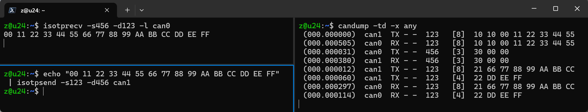

canfd 的 isotp 也早已实现, 具体查看 `isotprecv -h` 或 `isotpsend -h`

这对于分析或实现 uds 是很好的参考.

对于 C, 参考 `/usr/include/linux/can/isotp.h`, 用 setsockopt 设置 `SOL_CAN_ISOTP 的 CAN_ISOTP_OPTS, CAN_ISOTP_RECV_FC, CAN_ISOTP_LL_OPTS, CAN_ISOTP_RX_STMIN` 等. C++ 中也可以继续 asio 套用 isotp.

## WSL

主要步骤:

- 内核勾选 USB 或 SokcetCAN 的支持, 可参考过往或网页文章
- usbipd 挂载

对于 usbipd, 管理员终端, powershell 里面:

```bash
# 停掉所有的bind
usbipd unbind -a

# 设备列表
> usbipd list
Connected:
BUSID  VID:PID    DEVICE                                                        STATE
5-4    34b7:ffff  USB 串行设备 (COM99)                                          Not shared

# 要挂载 5-4 这个 USB串行 设备
> usbipd bind --busid 5-4

> wsl -l
适用于 Linux 的 Windows 子系统分发:
Ubuntu (默认值)
Ubuntu-24.04
Ubuntu-20.04
Arch
Ubuntu-16.04

# 自动挂到 Ubuntu
usbipd attach -a -b 5-4 -w Ubuntu
```

wsl 里面可以 `lsusb` 或 `sudo dmesg` 查看设备

## 结语

j1939, uds, xcp, canopen, 时间同步, vcan vxcan, 错误帧, 自动速率识别... 就不一一赘述了, 部分可参考过往文章. 基于 SocketCAN 几乎总能找到或快速实现趁手的工具.

QQ 交流群 `嵌入式_机器人_自动驾驶交流群`: 1040239879

[https://github.com/weifengdq/SlcanX](https://github.com/weifengdq/SlcanX), 欢迎 Star

