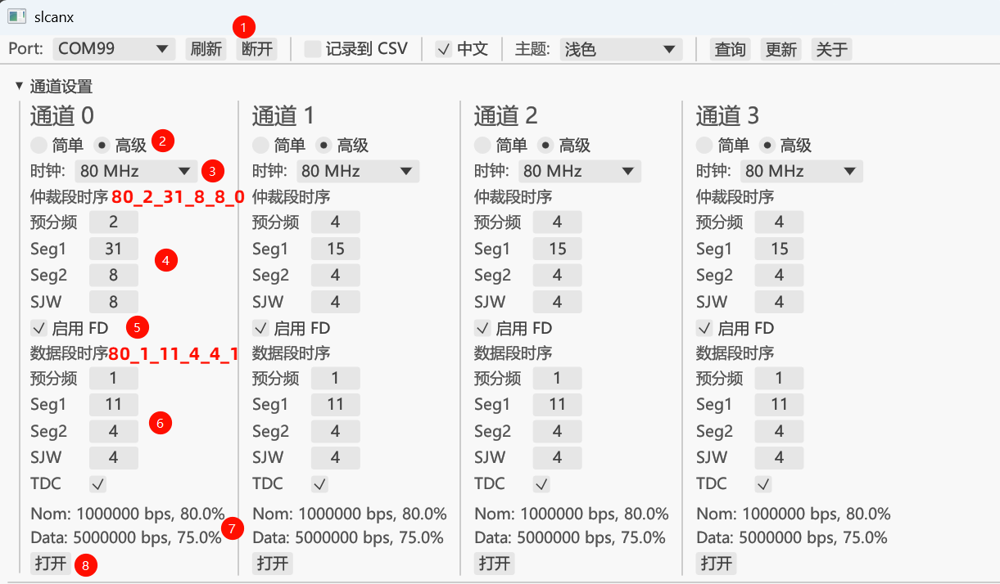
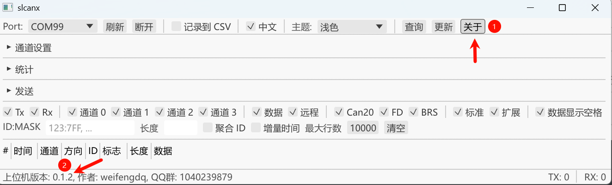
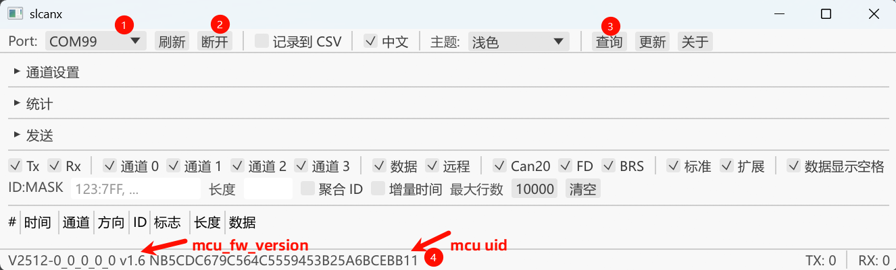
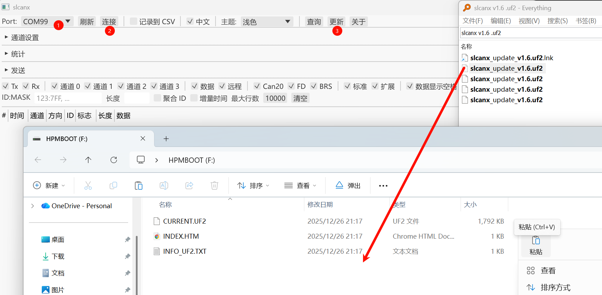
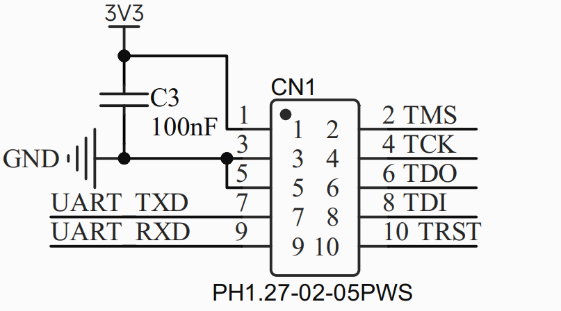
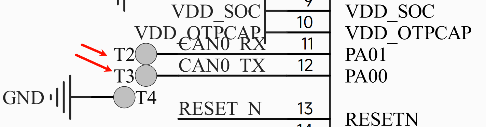

# SlcanX 标准版与隔离版用户手册


[TOC]

## 标准版 SlcanX


DB9 接口定义:


## 隔离版 SlcanX-ISO


## 性能参数参考

|                 | SlcanX                        | SlcanX-ISO                    |
| --------------- | ----------------------------- | ----------------------------- |
| MCU             | HPM5321IEG1                   | HPM5321IEG1                   |
| 通道数量        | 4                             | 4                             |
| USB接口         | Type-C, 480M                  | Type-C, 480M                  |
| CAN接口         | DB9 x1                        | 15EDG-3.81mm-8P               |
| CAN收发器       | TI TCAN1044VDRBRQ1            | 川土微 CA-IS2062A             |
| 最大速率        | 8M (实验室10M)                | 5M (实验室8M)                 |
| 收发能力        | 单路 ~ 3W帧/s, 4路 ~ 12W 帧/s | 单路 ~ 3W帧/s, 4路 ~ 12W 帧/s |
| 终端电阻        | 拨码开关                      | 拨码开关                      |
| 隔离            | ✖                             | CA-IS2062A 手册标称 2.5kVRMS  |
| 系统            | Win, Linux                    | Win, Linux                    |
| 二次开发        | 支持 C++ C# Python Rust       | 支持 C++ C# Python Rust       |
| Linux SocketCAN | ✔                             | ✔                             |

注: 

- CANFD理论帧率请参考 [CANFD每秒最多可以发送多少帧报文？【ZLG开发者社区】 - 知乎](https://zhuanlan.zhihu.com/p/547215936)
- 3W帧/s 指 `8Mbits/s, CANFD with BRS, id 0x555, dlc 0` 时的帧率
- 4路 ~ 12W 帧/s 依赖软件优化, 在有图形界面的上位机或脚本语言一般不容易达成.
- SlcanX 和 SlcanX-ISO 元器件上主要是 CAN 收发器的不同, `MCU固件/上位机软件/二次开发/Linux_SocketCAN` 是一样的.

## LED 指示灯说明

设备配备 8 个 LED，用于指示 4 路 CAN 通道的状态。

### 通道映射

每个通道都有两个对应的LED:

- **红色 LED (Rx/Error)**
- **白色 LED (Tx/Idle)**
- 标准版 SlcanX 位置在 CAN 收发器左侧
- 隔离板 SlcanX-ISO 位置在 USB 两边, 标有 0 1 2 3 的位置

### 状态逻辑

- **未初始化 / 关闭 (Closed)**:
  - **白灯**: 常亮。
  - **红灯**: 常灭。
- **已打开 (Opened)**:
  - **白灯 (Tx 指示)**:
    - **空闲**: 常灭。
    - **发送数据**: 闪烁 (每 50ms 检测一次，有发送活动则亮 10ms)。
  - **红灯 (Rx/Error 指示)**:
    - **正常状态**: 常灭。
    - **接收数据**: 闪烁 (每 50ms 检测一次，有接收活动则亮 10ms)。
    - **错误状态 (Passive / BusOff)**: 常亮 (每 500ms 检测一次，优先级高于接收闪烁)。
- **MCU固件更新**: 
  - **白灯**: 点更新后常灭, 固件更新后常亮进入APP
  - **红灯**: 点更新后常亮 2s 然后熄灭进入Boot.

### 注意事项

如下:

- 上位机打开通道后如果所有通道都没有CAN报文 LED 是全熄灭的, 和整机没有上电现象一样
- 上位机打开通道但没有关闭, 此时直接X掉上位机, MCU通道状态仍然是打开的(可观测白色LED), 下次打开上位机, 连接端口但不点打开通道, 也是能直接收到CAN报文的, 此时选择打开通道, 参数设置可能不生效, 可打开后关闭再打开.

## 位时间设置参考

下表中打 ✔ 的是 SlcanX 与 CANoe 对接测试过:

| BitRate(Mbit/s)_SamplePoint(‰) | SlcanX(CLK_PRE_SEG1_SEG2_SJW_TDC) | CANoe测试 |
| ------------------------------ | --------------------------------- | --------- |
| 0.125_800                      | 80_8_63_16_16_0                   | ✔         |
| 0.25_800                       | 80_4_63_16_16_0                   | ✔         |
| 0.5_800                        | 80_2_63_16_16_0                   | ✔         |
| 1_800                          | 80_2_31_8_8_0                     | ✔         |
| 2_800                          | 80_2_15_4_4_1                     | ✔         |
| 3_800                          | 60_1_15_4_4_1                     |           |
| 4_800                          | 80_1_15_4_4_1                     | ✔         |
| 5_750                          | 80_1_11_4_4_1                     | ✔         |
| 6_800                          | 60_1_7_2_2_1                      |           |
| 8_800                          | 80_1_7_2_2_1                      | ✔         |
| 9_750                          | 72_1_5_2_2_1                      |           |
| 10_750                         | 80_1_5_2_2_1                      |           |
| 12_800                         | 80_1_3_1_1_1                      |           |

注意:

- 12M 只能部分通信正常, 一般会报错误帧.
- 仲裁段与数据段时钟需保持一致, 所有通道的时钟也需保持一致, 优先80MHz

表格用于Win上位机, 如设置通道0为 1M 80% + 5M 75%, 查表格是 80_2_31_8_8_0 + 80_1_11_4_4_1, 那么上位机设置为:



表格用于Linux SocketCAN, 设置通道0为 1M 80% + 5M 75%, 参考 [SlcanX/u24_k614_slcanx/A_1M_5M.sh at main · weifengdq/SlcanX](https://github.com/weifengdq/SlcanX/blob/main/u24_k614_slcanx/A_1M_5M.sh):

```bash
#!/bin/bash

tty_device="/dev/ttyACM0"
can_ifs=(0 1 2 3)
txqueuelength=10000
# channel (0 1 2 3), CLK_PRE_SEG1_SEG2_SJW_TDC
nominal=(80_2_31_8_8_0 80_4_15_4_4_0 80_4_15_4_4_0 80_4_15_4_4_0)
data=(80_1_11_4_4_1 80_1_11_4_4_1 80_1_11_4_4_1 80_1_11_4_4_1)

...
```

## Win 上位机 slcanx

### 简要介绍

基于 [Rust egui](https://github.com/emilk/egui) 编写, 超高性能, 纵享丝滑, 目前实现的有:

- 中英切换, 多种主题
- 数据保存
- 多通道设置, 支持简单(`速率+采样点`)和高级(`时钟_预分频_Seg1_Seg2_Sjw_TDC`)设置
- 统计, 支持各通道 收发计数 帧率的当前-最小-最大-平均值
- 发送, 支持 `标准/扩展, CAN20/FD/BRS, 数据/远程, 长度, ID, ID自增, 数据输入, 数据递增, 发送次数, 发送计数, 复制, 粘贴, 删除, 列表的 全部开始/全部停止`
- 过滤: 支持 `TX/RX, 通道选择, 数据/远程, CAN20/FD/BRS, 标准/扩展, 多 ID:MASK, 长度` 等的过滤, 支持 ID聚合, 增量时间, 行数设置等
- 收发数据或错误帧显示
- 更新按钮用于升级MCU固件, 除更新固件以外的任何时候不要点它.

以下是部分截图:


### 查询上位机版本



### 查询 MCU 固件版本



如图, MCU 固件版本是 1.6, 后面是 uid.

### MCU 固件更新

选择Port, 连接, 点击更新按钮, 此时LED会出现4个红色常亮, 然后熄灭, 等待约5s, 弹出 HPMBOOT 盘符, 拖入或粘贴进最新 uf2 固件即可



注意:

- 点击更新后, 必须拖入新固件, 不然再次上电也依然停留在 BOOT 状态, 禁止拖入其它文件.

## 二次开发

二次开发(Secondary Development, SD) 支持 Python C++ C# Rust, 具体可参考 https://github.com/weifengdq/SlcanX/tree/main/sd 各个文件夹下的 README.md 以及 examples 示例程序.

以 Python 为例, 对接了大家都在用的 [python-can](https://python-can.readthedocs.io/en/stable/), 方便直接使用 python 的 j1939 isotp uds scp cantools 等相关流行的库 :

```powershell
# 可以先安装 python-can

# 安装slcanx的python-can插件
cd sd\python-can-slcanx
pip install .

# 最简示例
import can
# Open channel 0 on COM3
bus0 = can.Bus(interface='slcanx', channel='COM3', slcanx_channel=0, bitrate=500000)
# Open channel 1 on COM3 (shares the same serial port)
bus1 = can.Bus(interface='slcanx', channel='COM3', slcanx_channel=1, bitrate=500000)
msg = can.Message(arbitration_id=0x123, data=[0, 1, 2, 3, 4, 5, 6, 7], is_extended_id=False)
bus0.send(msg)
for msg in bus0:
    print(msg)
    
    
# 自定义 1M 80% + 8M 80% 的示例
bus = can.Bus(interface='slcanx', channel='COM3', slcanx_channel=0, fd=True)
cmd_arb = "a80_2_31_8_8_0"
cmd_data = "A80_1_7_2_2_1"
bus.send_cmd(cmd_arb)
bus.send_cmd(cmd_data)
bus.close_channel()
bus.open_channel()
    
# 其它示例
cd sd\python-can-slcanx\examples
```

Python examples文件夹下提供的示例如下:

- 01_simple_std.py, the id 0x123 message is sent once
- 02_periodic.py, the id 0x100 message is sent every second
- 03_multi_std_threading.py, open all 4 channels and listen/send in separate threads
- 04_multi_std_asyncio.py, open all 4 channels and listen/send using asyncio
- 05_simple_fd.py, sending and receiving CAN FD frames, 500K 80% + 2M 80%
- 06_multi_fd_threading.py, open all 4 channels with CAN FD and listen/send in separate threads, 1M 80% + 8M 80%
- 07_multi_fd_asyncio.py, open all 4 channels with CAN FD and listen/send using asyncio, 1M 80% + 8M 80%
- 08_custom_timing.py, applying custom CAN FD timing settings, 1M 80% + 8M 80%
- 09_multi_custom_timing_threading.py, open all 4 channels with custom CAN FD timing and listen/send in separate threads, 1M 80% + 8M 80%
- 10_multi_custom_timing_asyncio.py, open all 4 channels with custom CAN FD timing and listen/send using asyncio, 1M 80% + 8M 80%

## Linux SocketCAN

### 内核驱动

[weifengdq/SlcanX: Four-channel CANFD Analyzer](https://github.com/weifengdq/SlcanX)

在以下平台测试通过

- `u20_k515_slcanx/`: 
  - SlcanX driver and scripts for Ubuntu 20.04 with Kernel 5.15.x
  - Target platform: NVIDIA Orin Ubuntu 22.04 with Kernel 5.15.x (can2 can3 can4 can5)
- `u22_k68_slcanx/`: SlcanX driver and scripts for Ubuntu 22.04 with Kernel 6.8.x
- `u24_k614_slcanx/`: SlcanX driver and scripts for Ubuntu 24.04 with Kernel 6.14.x

以 u24_k614_slcanx 为例:

```bash
cd u24_k614_slcanx

# 编译用户空间程序 slcandx
cd slcandx && make && cd ..
# 编译内核程序 slcanx
cd slcanx_module && make && cd ..

# 设备 /dev/ttyACM0, 所有通道 1M 80% + 5M 75%
./A_1M_5M.sh

# 用 ifconfig 或 ip link 命令查看 can 状态
# 用 can-utils 进行测试
```

注意:

- u24_k614_slcanx 文件夹的 shell 脚本是最完善的, 建议 u20_k515_slcanx 和 u22_k68_slcanx 拿 u24_k614_slcanx 的 A_1M_5M.sh 脚本改动使用.  

具体使用与测试参考公众号文章: [SlcanX 的 Linux SocketCAN 配置与使用](https://mp.weixin.qq.com/s/H5gO3Wu3oO3-Z9J_vRkp3g)

### SocketCAN开发示例

参考 https://github.com/weifengdq/SlcanX/blob/main/linux_training/README.md

## 自行开发固件

对于想基于 HPM5321 自己开发固件的, 推荐购买隔离版 SlcanX-ISO:

- 引出了 1.27_2x5P 10PIN JTAG, 含调试串口(PY00, PY01, 非Boot串口),  ~~众所周知~~, HPM 电源复杂, 引脚少, 复用严重, JTAG与CAN1, CAN2冲突, 需要先按下Boot后插入USB, 然后才能连接调试器
  - 
- 引出了串口Boot, 对应CAN0使用的引脚 PA00 PA01, 对应隔离版上的贴片焊盘, 可手工焊线, ~~众所周知~~, HPM53xx 只有 100PIN 封装的才有 USB Boot, 其余封装只有 UART Boot, 按下Boot后插入USB, 搭配 [HPM Manufacturing Tool-软件开发资料-先楫半导体](https://www.hpmicro.com/design-resources/development-software/10) 使用
  - 
- JTAG 和 UART Boot 焊盘在 PCB 的位置:
  - 

## 购买方式与交流群

QQ 交流群 `嵌入式_机器人_自动驾驶交流群`: 1040239879, 群公告可自行下载资料

仓库地址: https://github.com/weifengdq/SlcanX

闲鱼购买, 搜用户 weifengdq, 主页查找, 或使用以下链接:

- 【闲鱼】 https://m.tb.cn/h.7iSXCan?tk=xOGgUYmWBmV CZ005 「我在闲鱼发布了【SlcanX四路CANFD分析仪, 10Mbits/s 最大】」 点击链接直接打开
- 【闲鱼】 https://m.tb.cn/h.77DiMD8?tk=C63yUYm33ky CZ356 「我在闲鱼发布了【SlcanX 隔离版, 四路 CANFD 分析仪:】」 点击链接直接打开
