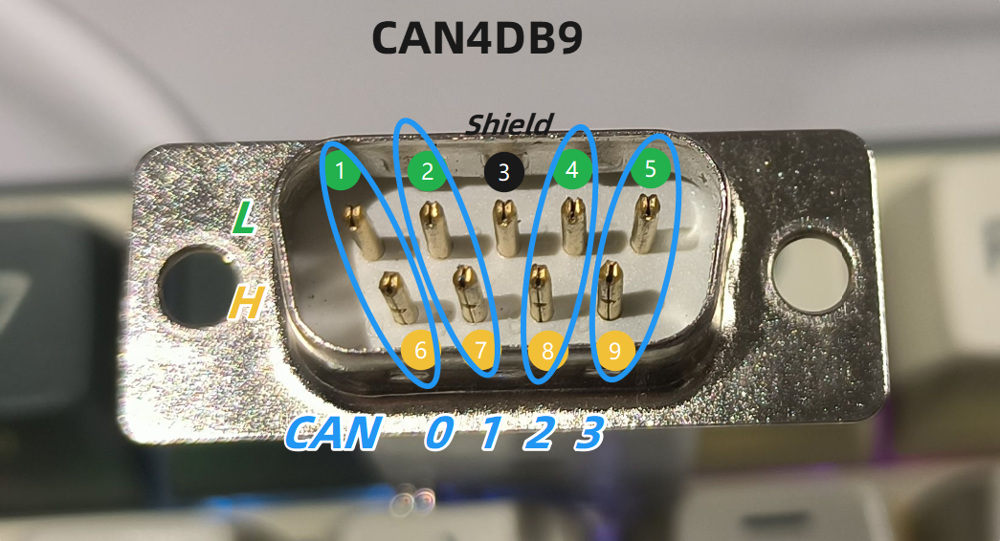
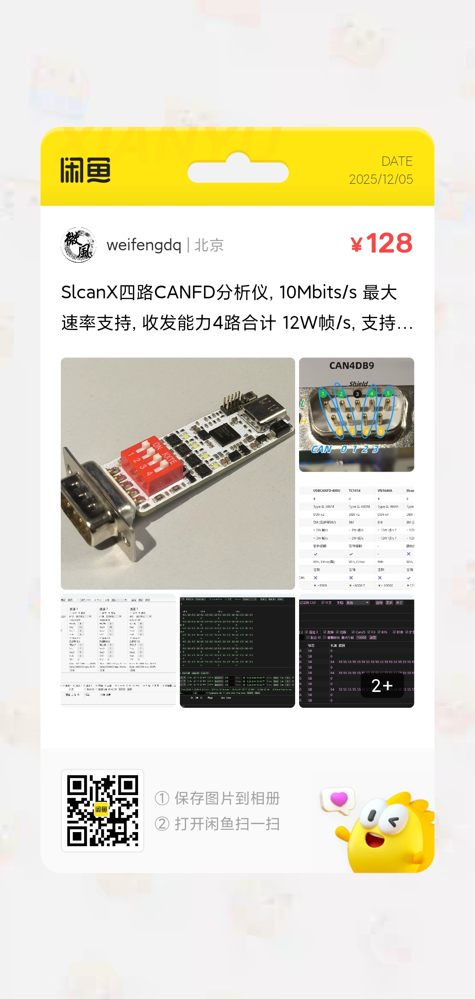

# SlcanX 用户手册

[TOC]

## 性能参数

|                 | SlcanX                        |
| --------------- | ----------------------------- |
| 通道数量        | 4                             |
| USB接口         | Type-C, 480M                  |
| CAN接口         | DB9 x1                        |
| 最大速率        | 8M (实验室10M)                |
| 发送能力        | 单路 ~ 3W帧/s, 4路 ~ 12W 帧/s |
| 接收能力        | 单路 ~ 3W帧/s, 4路 ~ 12W 帧/s |
| 终端电阻        | 拨码开关                      |
| 隔离            | ✖                             |
| 系统            | Win, Linux                    |
| 二次开发        | 支持 C++ C# Python Rust       |
| Linux SocketCAN | ✔                             |

## 接口定义

## 位时间设置

下表中打 ✔ 的是 SlcanX 与 CANoe 对接测试过:

| BitRate(Mbit/s)_SamplePoint(‰) | SlcanX(CLK_PRE_SEG1_SEG2_SJW_TDC) | CANoe测试 |
| ------------------------------ | --------------------------------- | --------- |
| 0.125_800                      | 80_8_63_16_16_0                   | ✔         |
| 0.25_800                       | 80_4_63_16_16_0                   | ✔         |
| 0.5_800                        | 80_2_63_16_16_0                   | ✔         |
| 1_800                          | 80_2_31_8_8_0                     | ✔         |
| 2_800                          | 80_2_15_4_4_1                     | ✔         |
| 3_800                          | 60_1_15_4_4_1                     |           |
| 4_800                          | 80_1_15_4_4_1                     | ✔         |
| 5_750                          | 80_1_11_4_4_1                     | ✔         |
| 6_800                          | 60_1_7_2_2_1                      |           |
| 8_800                          | 80_1_7_2_2_1                      | ✔         |
| 9_750                          | 72_1_5_2_2_1                      |           |
| 10_750                         | 80_1_5_2_2_1                      |           |
| 12_800                         | 80_1_3_1_1_1                      |           |

注意: 12M 只能部分通信正常, 一般会报错误帧.

## Win 上位机 slcanx

基于 [Rust egui](https://github.com/emilk/egui) 编写, 超高性能, 纵享丝滑, 目前实现的有:

- 中英切换, 多种主题
- 数据保存
- 多通道设置, 支持简单(`速率+采样点`)和高级(`时钟_预分频_Seg1_Seg2_Sjw_TDC`)设置
- 统计, 支持各通道 收发计数 帧率的当前-最小-最大-平均值
- 发送, 支持 `标准/扩展, CAN20/FD/BRS, 数据/远程, 长度, ID, ID自增, 数据输入, 数据递增, 发送次数, 发送计数, 复制, 粘贴, 删除, 列表的 全部开始/全部停止`
- 过滤: 支持 `TX/RX, 通道选择, 数据/远程, CAN20/FD/BRS, 标准/扩展, 多 ID:MASK, 长度` 等的过滤, 支持 ID聚合, 增量时间, 行数设置等
- 收发数据或错误帧显示
- 更新按钮用于升级MCU固件, 除更新固件以外的任何时候不要点它.

以下是部分截图:

## 二次开发

二次开发(Secondary Development, SD) 支持 Python C++ C# Rust, 具体可参考 https://github.com/weifengdq/SlcanX/tree/main/sd 各个文件夹下的 README.md 以及 examples 示例程序.

## Linux SocketCAN

参考 https://github.com/weifengdq/SlcanX/blob/main/linux_training/README.md

## 购买方式与交流群

QQ 交流群 `嵌入式_机器人_自动驾驶交流群`: 1040239879

仓库地址: https://github.com/weifengdq/SlcanX

闲鱼购买:

